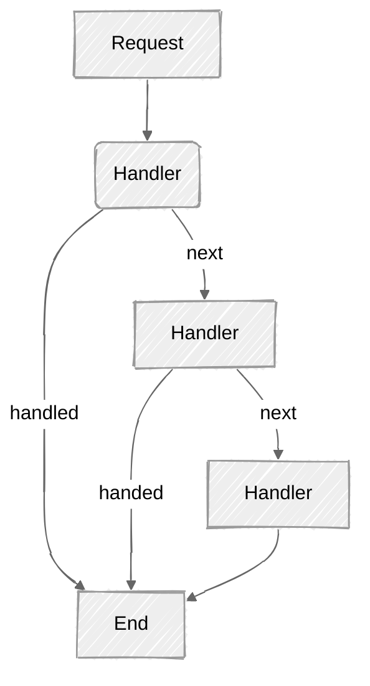

# Chain of Responsibility Pattern

The "Chain of Responsibility" is a behavioral design pattern that moves the decision logic into isolated "handler"
objects. A more thorough explanation can be found here
[Refactoring Guru: Chain of Responsibility](https://refactoring.guru/design-patterns/chain-of-responsibility).

Here is a diagram of a very basic Chain of Responsibility pattern:

## Swift Demo Project

Here is the [README](../DesignPatterns/ChainOfResponsibility/README.md) for the demo project. To run the demo open the
[Package.swift](../DesignPatterns/ChainOfResponsibility/Package.swift) file in Xcode and press the play button.
