# Intermediate Git

## Merge Strategies

### Normal Merge

A normal merge preserves the entire history of commits. There is no rebasing, or changing of history, on either of the
two branches being merged.

A "Fast Forward" merge is performed when the two branches being merged have not diverged. In this example the `topic`
branch contains new commits, but the `main` branch does not.

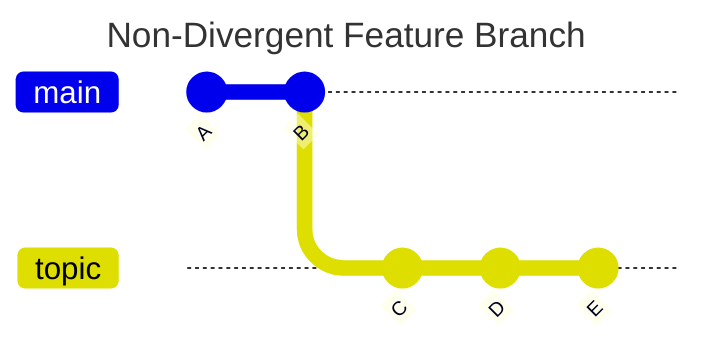

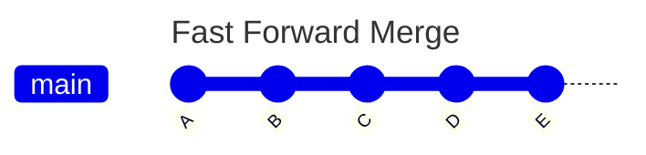

When the two branches being merged have diverged (both branches have commits that are not in common) Git will create
what is known as a "Merge Commit" which is a special type of commit that contains no changes but rather ties the
histories of the two branches together.

In this example, commit `D` and commit `E` are parent commits of the merge commit (the commit shown as a open circle).

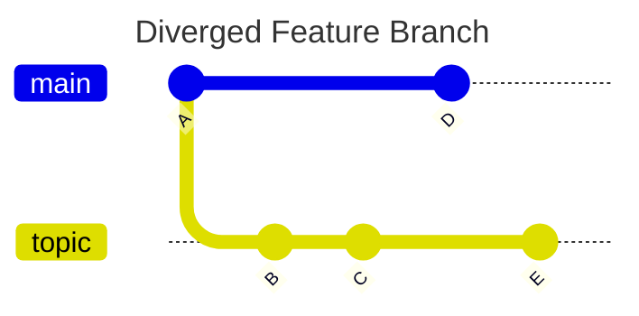

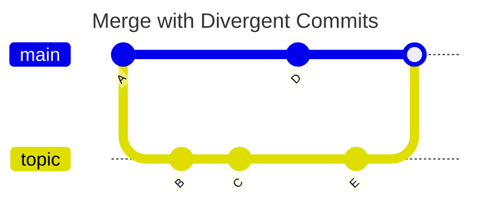

It is also possible to force a merge commit to be created even when "Fast Forward" merge would be possible. This option
is the default when merging Pull Requests (PRs) in GitHub.

```bash
git switch main
git merge --no-ff topic
```


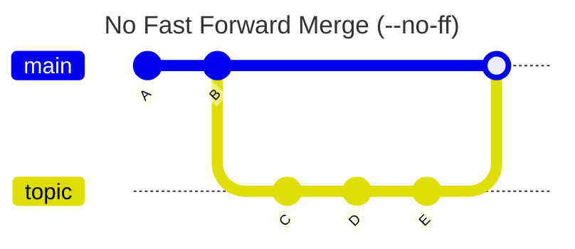

### Squash and Merge

A "Squash Merge" differs from a "Normal Merge" in that history is not preserved. This type of merge begins by combining
all commits on the branch to be merged into a single commit, effectively "squashing" them into a single change set and
combining the commit messages from all commits (by default) into the new single commit.

In this example commits `C`, `D` and `E` are combined into a single commit `F` on the target branch, which is `main` in
this case.


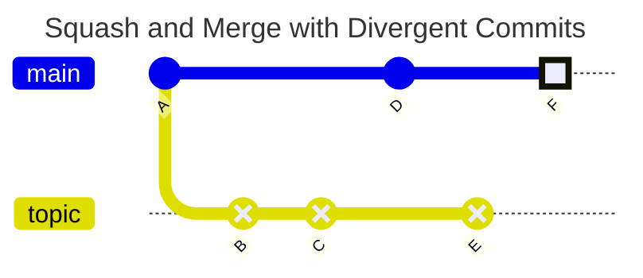

Notice that the `topic` branch is untouched. The commit `F` contains the same changes as the three commits on the
`topic` branch. The two branches no longer share a common history.

It is also recommended to discontinue adding commits to the `topic` branch since they no longer share the same
history. Instead the `topic` branch should be deleted after the merge, and a new `topic` branch should be created from
the base branch (`main` in this example).

### Rebase and Merge

A "Rebase and Merge" is similar to a "Squash Merge" in that the full history of the two branches is not preserved. It
differs from "Squash Merge" where the commits on the `topic` branch are individually "rebased" onto the target branch
(`main` in this example). Like "Squash Merge" the `topic` branch is untouched and remains diverged from the `main`
branch.

It is also recommended to avoid adding any new commits to the `topic` branch, which should be deleted after merging.
Any new work should be performed on a new branch based on the `main` branch.


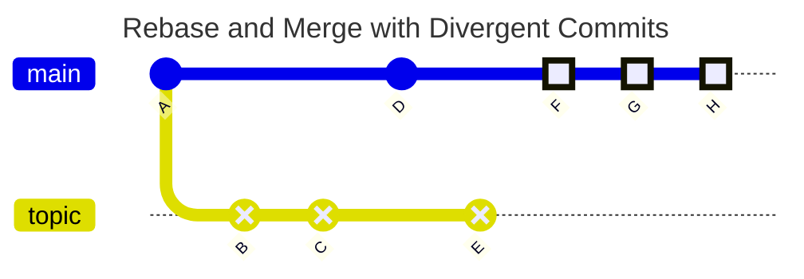

### Long Running Branches

In the following example the `main` and `develop` branches are call "Long Running" because they are expected to remain
after a merge. New commits will be add to these branches as feature work continues.

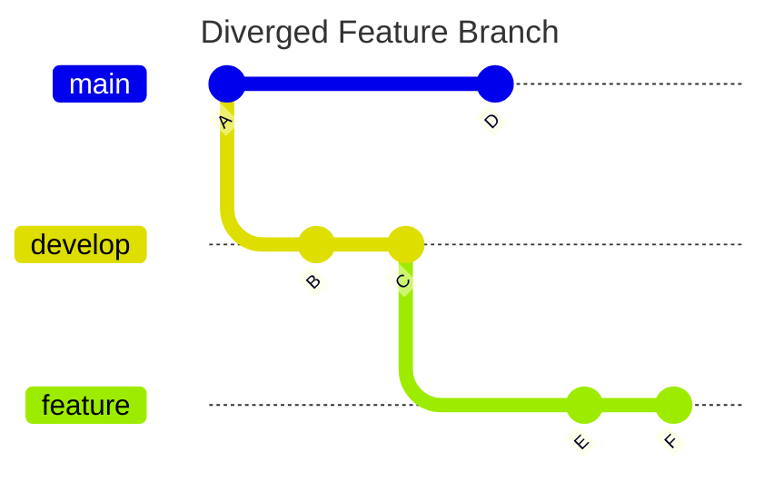

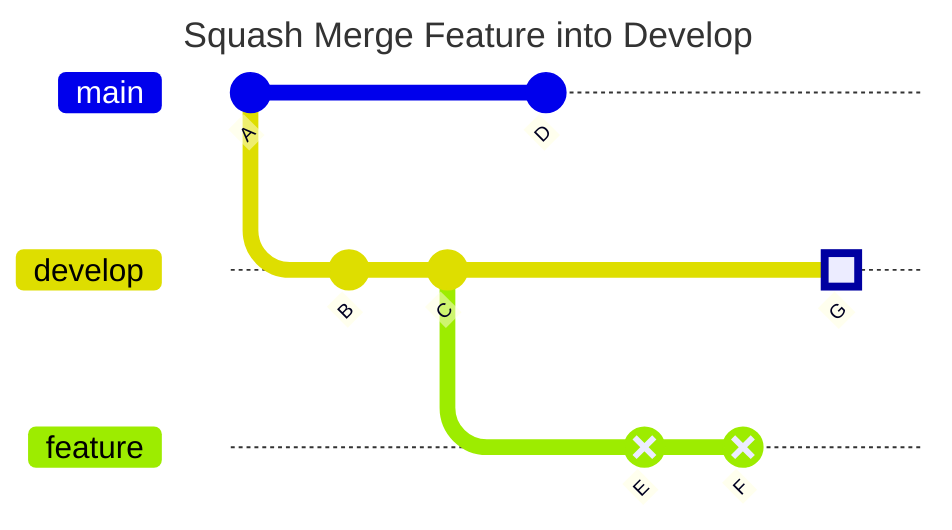

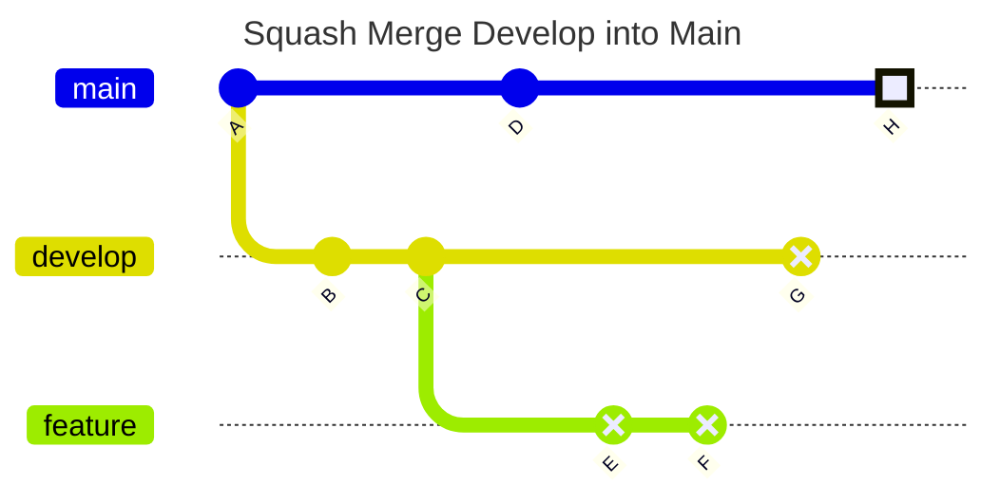

The above example demonstrates the problem with performing "Squash Merge" or "Rebase and Merge" operations between two
long running branches.

Notice that `main` and `develop` have diverged and do not share a common history.

Even though the `H` commit on `main` contains the same changes that were "squashed" into `G` on `develop` the "Squash
Merge" from `develop` to `main` creates another new commit (`H` on `main`). As such Git can no longer track the full
history of the two long running branches.

Attempting to "backport" from `main` to `develop` doesn't really solve the issue either, since Git will attempt to
reapply all the changes in commit `H` back to `develop`. There is no way to track the history, even though `develop`
already contains all the same changes.

One solution to this problem is to use a "Normal Merge" between long running branches.

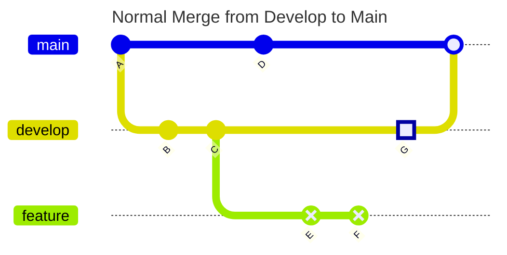

Remember to delete the "Short Lived" branch (`feature` in this example) where "Squash Merge" was used.

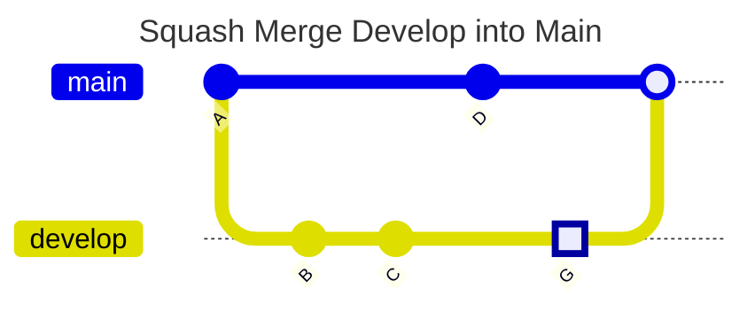

From here it is safe to continue committing new changes to the `develop` branch.

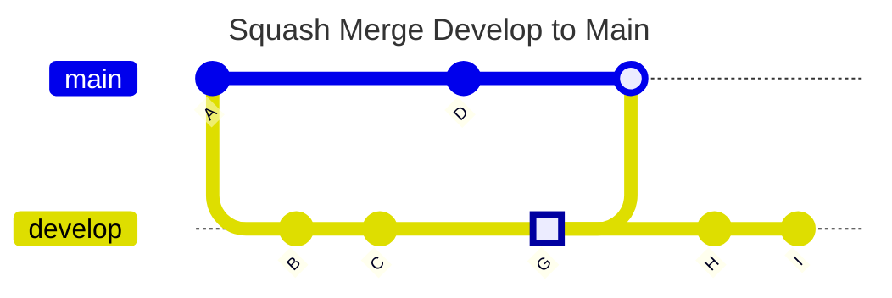

## Interactive Rebase

Interactive rebase is useful for maintaining a cleaner Git history. It can be used before pushing a new feature
branch that will be used to create a Pull Request (PR) for other team members to review.

Let's say we have a history that looks something like the following, and assume that the `topic` branch only exists
locally never having been pushed to a remote repository.

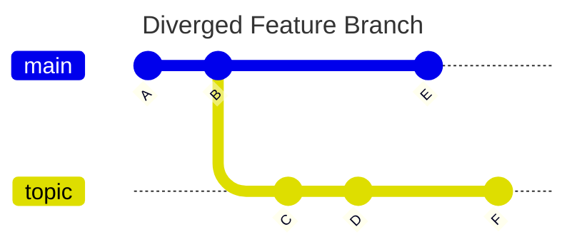

In this example multiple commits have been added as the feature is being developed. Some commits may be work-in-progress
changes, bugs or typo fixes, etc.

When it's time to complete the feature, and prepare a PR for review, we first check the Git log. We notice that a new
commit has been added to the `main` branch while we were working on our `topic` branch. We could use one of the above
merging strategies, which would work. However, an alternative option would be to "rebase" all the commits on the `topic`
branch into a single commit before pushing to the remote repository. This gives us a chance to clean up our local
commits, update commit messages, etc. This technique can be used to maintain a cleaner history.

Here's what that might look like in the Git history log:

```bash
$ git log --graph --oneline --all
* ba8f864 (HEAD -> topic) F
* 1acfeca D
* f099586 C
| * df5afca (main) E
|/  
* 5d2a95d B
* 76a6bc4 A
```

First we will combine all our local commits on `topic` into a new commit that contains all the changes.

```bash
git switch topic
git rebase -i HEAD~3
```

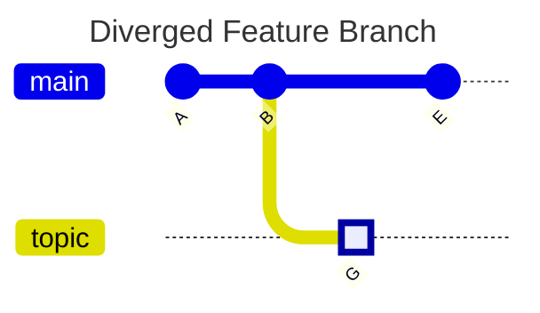

Now the Git log should look something like this:

```bash
$ git log --graph --oneline --all
* 44da8db (HEAD -> topic) G
| * df5afca (main) E
|/  
* 5d2a95d B
* 76a6bc4 A
```

Next we want to integrate the new commit from `main` into our `topic` branch by rebasing the `topic` branch onto the
`main` branch:

```bash
git switch topic
git rebase main
```

This might result in merge conflicts, which would need to be resolved before the `rebase` can be completed.

The resulting history would look like this following.

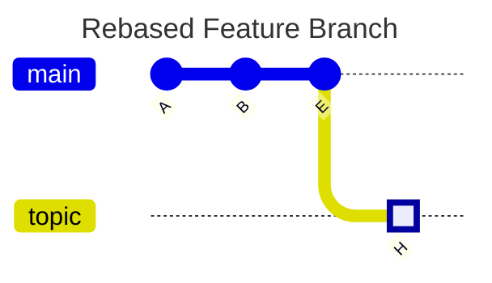

The history should now appear to be linear (no diverging commits):

```bash
$ git log --graph --oneline --all
* f78a691 (HEAD -> topic) H
* df5afca (main) E
* 5d2a95d B
* 76a6bc4 A
```

Note that the `H` commit above is the same change as `G` commit in the previous graph, however the commit hash will be
different as a result of rebasing the `topic` branch.
